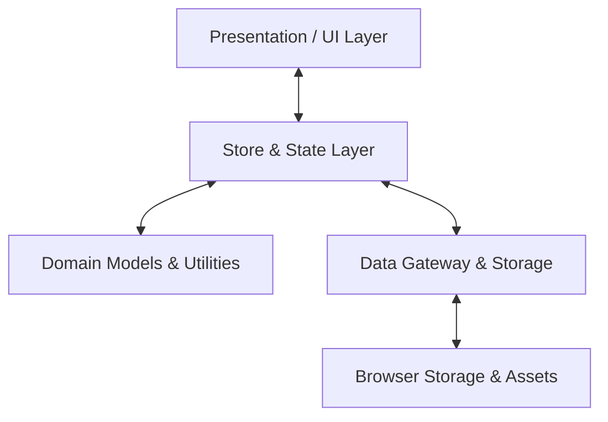

# 🕵️‍♂️ Zero Origin — Investigation Board

> **A modern, offline-first digital corkboard and link-analysis board for investigators, researchers, writers, and analysts.**

[](file:///b:/zeroorigin/zero-origin.html)
[](file:///b:/zeroorigin/zero-origin.html)
[](file:///b:/zeroorigin/zero-origin.html)
[](file:///b:/zeroorigin/zero-origin.html)

---

## 📌 Overview

**Zero Origin** is an interactive, dark/cyber-themed digital investigation board (corkboard / murder board / conspiracy board). Designed for mapping complex networks of people, evidence, locations, vehicles, documents, and organizations, it combines spatial card layouts with customizable yarn/thread connections, structured metadata, timelines, and multi-case filtering.

Delivered as a **single, standalone HTML application (`zero-origin.html`)**, Zero Origin requires zero external dependencies, build steps, or backend servers.


---

## ✨ Key Features

### 🗂️ 1. Entity Cards & Custom Profiling
* **7 Specialized Entity Types**:
  * 👤 **Person**: Suspects, witnesses, persons of interest, contacts.
  * 🔍 **Evidence**: Physical items, forensics, artifacts, recovered materials.
  * 📍 **Place**: Crime scenes, meeting points, addresses, districts.
  * 🚗 **Vehicle**: Cars, license plates, transit data.
  * 📄 **Document**: Transcripts, logs, financial filings, receipts.
  * 🏢 **Organization**: Corporations, shell companies, syndicates, departments.
  * ⚡ **Custom**: User-defined entities with custom color accents.
* **Rich Metadata & Notes**: Assign custom pins, titles, subtitles, summaries, and expandable notes.
* **Photo Uploads & Lightbox**: Attach photos directly to cards with an instant full-screen lightbox preview.
* **Dynamic Custom Fields**: Add arbitrary key-value fields per card:
  * `Text`, `Number`, `Date`, `Checkbox`, `URL Link`, `Rich Text`, `Image`, and `File Attachment`.
* **Quick-Copy Popover**: Hover over any card on the canvas to view custom fields with one-click clipboard copying.

### 🧵 2. Connection Threads (Link Analysis)
* **Visual Relationship Threads**: Connect related cards using curved Bézier threads.
* **Color Palette & Styling**: Choose from 7 yarn colors (`Red`, `Blue`, `Green`, `Yellow`, `Purple`, `Orange`, `Black/Muted`) with solid or dashed styling.
* **Thread Labels**: Annotate connections with relationship descriptors (e.g., *"employed by"*, *"spotted near"*, *"financial ties"*).
* **Port Connectors**: Instant drag-and-click connection ports on card hover.

### 🧭 3. Infinite Canvas & Navigation
* **Smooth Pan & Zoom**: Fluid viewport transformation from **15% to 300%** with mouse wheel or toolbar controls.
* **Fit to Screen (`F`)**: Automatically bounds and centers all cards in view.
* **Snap-to-Grid**: Optional 20px grid snapping for structured alignment.
* **Resizing & Positioning**: Freely reposition and resize card dimensions on the board.

### 🔬 4. Investigation & Analysis Modes
* **Live Search**: Instant full-text search across titles, subtitles, notes, and custom field values with non-destructive dimming/focusing.
* **Case Management**: Segment investigations into distinct cases or filter the board to isolate a specific operation.
* **Timeline View**: Automatically aggregates and chronologically orders all cards containing `Date` fields.
* **Layers Panel**: View all board items in one list, toggle item visibility, or lock cards against accidental movement.

### 💾 5. Durable Storage & Portability
* **Offline-First Architecture**: Changes automatically persist in local storage.
* **Partitioned Asset Store**: Images and attachments are stored in separate asset keys to eliminate storage limits.
* **Full Undo / Redo**: 80-step operation history stack with keyboard shortcuts.
* **Export Options**:
  * **JSON (`.zorigin.json`)**: Fully portable, self-contained file with inlined assets for sharing and backups.
  * **High-Res PNG**: Renders an image of the entire board with cards, connections, and grid texture.
  * **Print / PDF**: Clean, print-optimized stylesheet for physical briefing packets or PDF generation.
  * **JSON Import**: Instant board restoration and asset migration.

---

## 🚀 Getting Started

### Prerequisites
* Any modern web browser (Google Chrome, Microsoft Edge, Mozilla Firefox, Safari, Brave, Opera).

### Running Zero Origin
1. Open the [zero-origin.html](file:///b:/zeroorigin/zero-origin.html) file directly in your browser:
   * **Double-click** `zero-origin.html` in your file explorer, or
   * Drag and drop `zero-origin.html` into an open browser window, or
   * Serve with any local HTTP server:
     ```bash
     npx serve .
     # or
     python -m http.server 8000
     ```
2. The board will initialize immediately with persistent local storage enabled.

---

## ⌨️ Keyboard Shortcuts

| Shortcut | Action |
| :--- | :--- |
| <kbd>Ctrl</kbd> + <kbd>Z</kbd> / <kbd>Cmd</kbd> + <kbd>Z</kbd> | **Undo** last action |
| <kbd>Ctrl</kbd> + <kbd>Y</kbd> / <kbd>Ctrl</kbd> + <kbd>Shift</kbd> + <kbd>Z</kbd> | **Redo** action |
| <kbd>Ctrl</kbd> + <kbd>F</kbd> | Focus **Search bar** |
| <kbd>Enter</kbd> (in search) | Focus first search match on canvas |
| <kbd>F</kbd> | **Fit all cards** to screen |
| <kbd>Delete</kbd> / <kbd>Backspace</kbd> | **Delete** selected card or thread |
| <kbd>Escape</kbd> | Clear selection / Exit connect mode / Close lightbox / Clear search |
| **Double Click** (on card) | Open Properties panel and focus Title |
| **Scroll Wheel** | Zoom in / out at cursor point |
| **Drag Canvas** | Pan viewport |

---

## 🏗️ Architecture & Codebase Design

The single-file architecture in [`zero-origin.html`](file:///b:/zeroorigin/zero-origin.html) is structured in four decoupled layers:



1. **Domain Layer**:
   - Defines entity definitions (`CARD_TYPES`, `THREAD_COLORS`, `FIELD_TYPES`).
   - Factory functions (`newCard`, `newConnection`, `newCase`, `newField`, `seedProject`).
2. **Data Layer**:
   - Manages asynchronous persistence and partitioned key/value asset storage.
   - Handles serialization, asset inlining for export, and import parsing.
3. **Store / State Layer**:
   - Central reactive application state (`Store.project`, `Store.history`, `Store.assets`).
   - Mutation handlers (`addCard`, `deleteCard`, `updateCard`, `addConnection`, `deleteConnection`).
   - Undo/redo transaction stack.
4. **Render / UI Layer**:
   - Canvas pan/zoom coordinate math and Bézier curve SVG connection rendering.
   - GPU layer promotion (`will-change: transform`) during active gestures for crisp settling.
   - Sidebar tab management (Tools, Layers, Timeline, Cases) and Properties inspector.

---

## 📦 Project File Format (`.zorigin.json`)

When exported, Zero Origin produces a human-readable JSON schema containing the investigation graph and bundled assets:

```json
{
  "id": "proj_xyz789",
  "name": "Case Operation Aurora",
  "createdAt": "2026-09-01T00:00:00.000Z",
  "cases": {
    "case_123": {
      "id": "case_123",
      "name": "Main Incident",
      "color": "#ff3b5c",
      "createdAt": "2026-09-01T00:00:00.000Z"
    }
  },
  "cards": {
    "card_abc123": {
      "id": "card_abc123",
      "type": "person",
      "title": "Jane Doe",
      "subtitle": "Key Witness",
      "x": 120,
      "y": 240,
      "w": 220,
      "h": 132,
      "color": "#00e5ff",
      "image": "data:image/png;base64,...",
      "notes": "Witness observed blue sedan leaving alley.",
      "caseId": "case_123",
      "visible": true,
      "locked": false,
      "fields": [
        {
          "id": "f_1",
          "type": "date",
          "label": "Interview Date",
          "value": "2026-06-15"
        }
      ],
      "attachments": []
    }
  },
  "connections": {
    "conn_456": {
      "id": "conn_456",
      "from": "card_abc123",
      "to": "card_def456",
      "color": "red",
      "label": "spotted near",
      "style": "solid"
    }
  }
}
```

---

## 🔒 Privacy & Security

* **100% Local & Client-Side**: All data, images, and attachments remain entirely in your browser.
* **No Telemetry / No Tracking**: No external analytics, third-party CDNs, or remote API calls.
* **Air-Gapped Friendly**: Fully functional on isolated and offline workstations.

---

## 📄 License

This project is open source and available under the **MIT License**.
